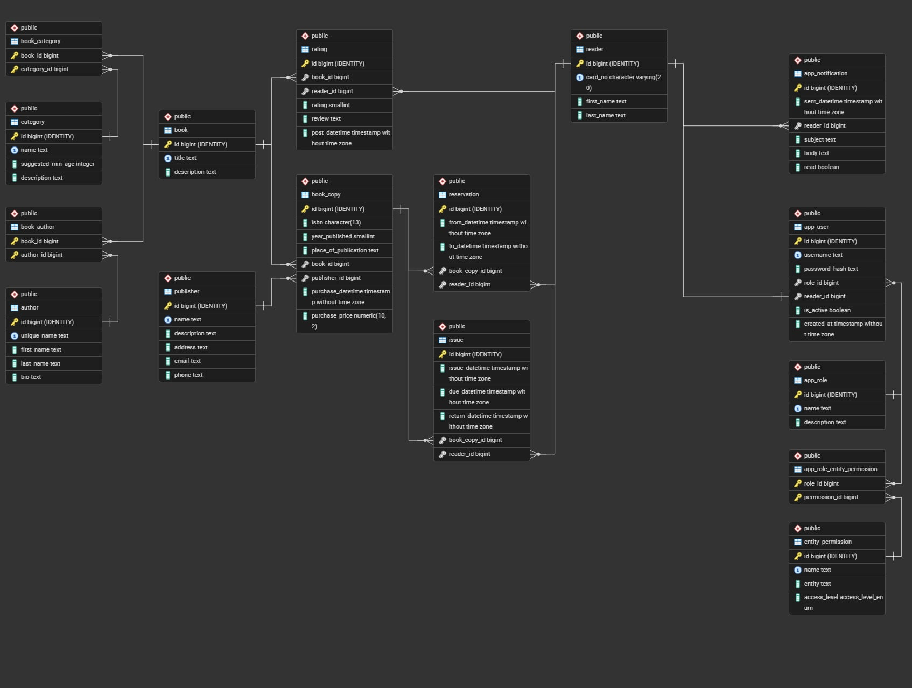

# Library Management System
This project was created as part of the Databases course at Wrocław University of Science and Technology. It is a web-based library management system built with Flask and PostgreSQL, containerized with Docker. The system allows managing books, authors, categories, publishers, readers, reservations, issues, ratings, and user permissions through a structured database and web interface.

## Technologies Used
- **Backend:** Flask (Python web framework)

- **Database:** PostgreSQL (with PL/pgSQL functions, triggers, views, and indexes)

- **Containerization:** Docker & Docker Compose

- **ORM:** SQLAlchemy

- **Frontend:** HTML templates with CSS styling

## System Overview
The system consists of a Flask web application connected to a PostgreSQL database. Key features include:

- **Database Schema:** Well-structured tables for books, authors, categories, publishers, readers, reservations, issues, ratings, users, roles, and permissions

- **Data Integrity:** Constraints, foreign keys, triggers to prevent overlapping reservations/issues

- **Performance:** Optimized indexes including GIN trigram indexes for text search and BRIN indexes for time-series data

- **Stored Procedures:** PL/pgSQL functions and procedures for common operations

- **Views:** Predefined views for book info, reader info, user info, and role permissions

- **Authentication:** User login system with role-based permissions

- **Admin Interface:** Superadmin panel for direct table management (CRUD operations)

- **CLI Tools:** Commands for creating superadmin users and syncing permissions

## Project Structure
```
library-management-system/
├── app/                       # Flask application
│   ├── static/                # CSS and favicon
│   ├── templates/             # HTML templates
│   ├── __init__.py            # App factory
│   ├── auth.py                # Authentication decorators
│   ├── commands.py            # CLI commands
│   ├── routes.py              # Route definitions
│   ├── table_registry.json    # Table name mappings
│   └── utility.py             # Helper functions
├── db/                        # Database schema files
│   ├── create_tables.sql      # Table definitions
│   ├── create_indexes.sql     # Performance indexes
│   ├── create_views.sql       # Database views
│   ├── create_triggers.sql    # Data integrity triggers
│   ├── create_functions.sql   # Helper functions
│   └── create_procedures.sql  # Stored procedures
├── .env.example               # Environment template
├── docker-compose.yml         # Docker services
├── Dockerfile                 # Web service image
├── requirements.txt           # Python dependencies
├── run.py                     # Application entry point
└── README.md                  # This file
```

## Setup Instructions

### 1. Clone the repository

```bash
git clone https://github.com/iwonieevo/library-management-system
cd library-management-system
```

### 2. Configure Environment Variables

Copy the example environment file and edit it with your configuration:

```bash
cp .env.example .env
```

### 3. Build and Start the Application

Use Docker Compose to build and start the application:

```bash
docker-compose up --build
```

This command will:

- Build the Flask web application image

- Start a PostgreSQL database container

- Initialize the database with all schema files

- Start the web application on the configured port

### 4. Initialize the Superadmin Account

```bash
docker-compose exec web flask create-superadmin
```

Follow the prompts to enter a username and password.

### 5. Sync Permissions (Optional)

Sync the permission system with the database tables:
```bash
docker-compose exec web flask sync-permissions
```

### 6. Access the Application
- **Web Application:** Open `http://localhost:8000` (or your configured `WEB_EXPOSED_PORT`)

- **Database:** Connect to `localhost:5433` (or your configured `DB_EXPOSED_PORT`) with your database credentials

## Environment Variables

The following environment variables can be configured in the `.env` file:
| Variable | Description | Default |
|-|-|-|
| `DB_NAME` | PostgreSQL database name | `postgres` |
| `DB_USER` | PostgreSQL username | `postgres` |
| `DB_PASSWORD` | PostgreSQL password | `password` |
| `DB_INTERNAL_PORT` | PostgreSQL port inside Docker | `5432` |
| `DB_EXPOSED_PORT` | PostgreSQL port exposed to host | `5433` |
| `WEB_INTERNAL_PORT` | Flask port inside Docker | `8000` |
| `WEB_EXPOSED_PORT` | Flask port exposed to host | `8000` |
| `SECRET_KEY` | Flask secret key for sessions | `dev-secret-change-me` |
| `FLASK_APP` | Flask application entry point | `app:create_app` |
| `APP_SUPERADMIN_ROLE` | Name of the superadmin role | `superadmin` |

## Database Features

### Schema Design
The database includes 16 tables with proper normalization, foreign key constraints, and data validation rules.



### Performance Optimizations
- GIN trigram indexes for text search on book titles, descriptions, author names, etc.

- BRIN index for time-series data (notifications)

- B-tree indexes on foreign keys and frequently queried columns

### Data Integrity
- Triggers prevent overlapping book reservations and issues

- Check constraints ensure data validity (ISBN format, price non-negative, date ordering)

- Cascading deletes where appropriate, restricted deletes where needed

### Business Logic
- PL/pgSQL functions for common lookups (get book ID by title, get publisher ID by name, etc.)

- Stored procedures for complex operations (add/update books with authors and categories)

- Materialized views for reporting and dashboards

### Database Reset

To completely reset the database:

```bash
docker-compose down -v
docker-compose up --build
```
This will remove all Docker volumes and recreate the database from scratch.